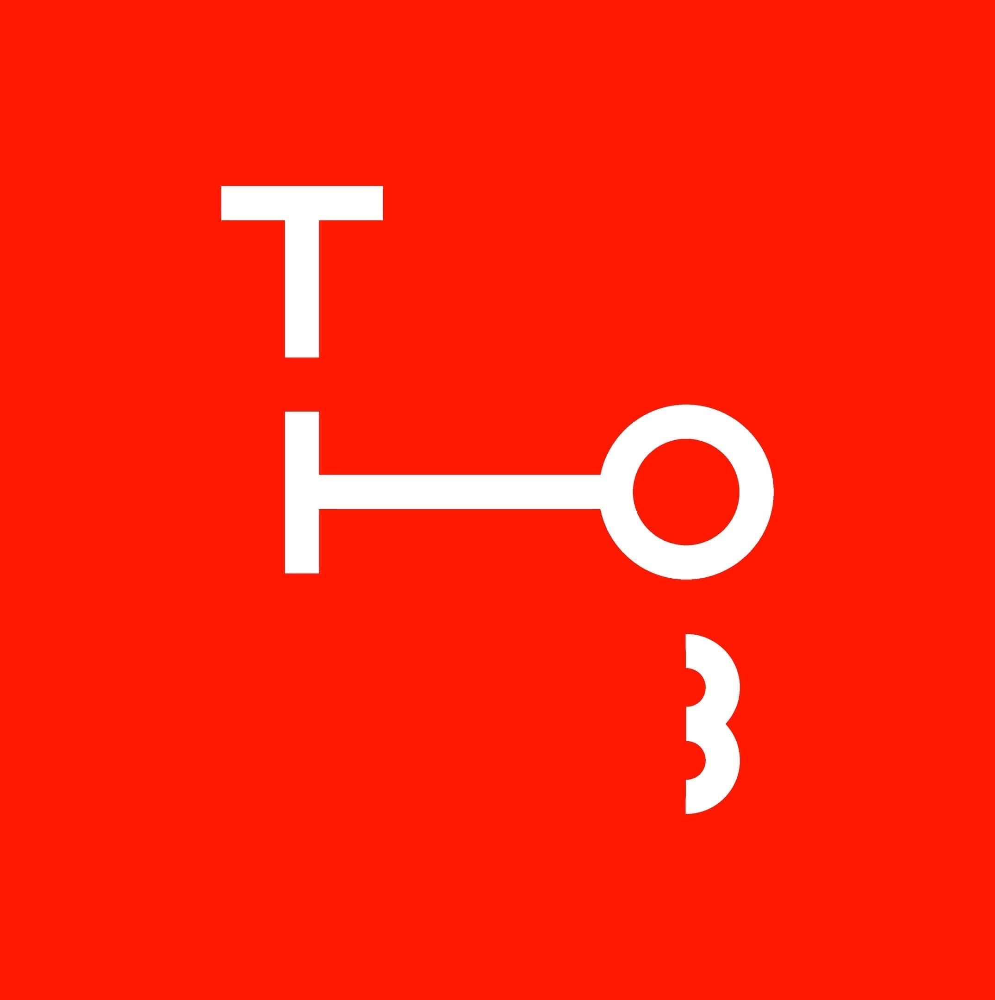
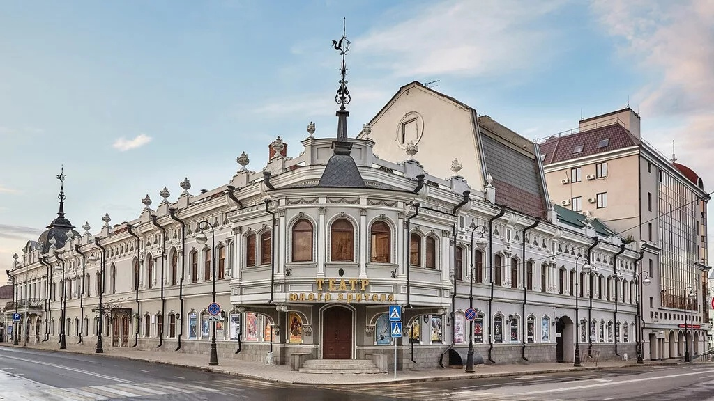
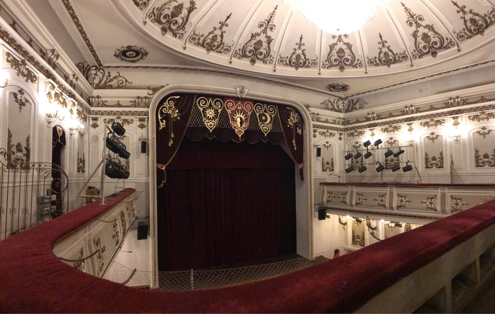

<!DOCTYPE html>
<html>

<head>

		<meta charset="utf-8">
		<link rel="stylesheet" type="text/css" href="css/main.css">		
		<link rel="stylesheet" href="css/owl.carousel.min.css">
		<link rel="stylesheet" href="css/owl.theme.default.min.css">
		<link
    rel="stylesheet"
    href="https://cdnjs.cloudflare.com/ajax/libs/animate.css/4.1.1/animate.min.css"
  />
  <link rel="icon" href="assets/images/logo.jpg" type="image/x-icon">
  <meta charset="utf-8">
  <link href = "css/style.css" rel = "stylesheet" type = "text/css" />
  <title>Театр Юного Зрителя</title>
	
</head>

	<body>
		<header class="mainHeader">
		  	

		  		

		  			<a href="main.html">Главная</a>
		  			<a href="poster.html">Афиша</a>
		  			<a href="news.html">Новости</a>
		  			<a href="museum.html">О театре</a>		
		  		

		  		
		  	

			

			    

			    	

			    		
			    	

			    

			    

			    

			

			

			

		

			

				<h1 class="up">Первый спектакль</h1>
				<h2 class="down">1932</h2>	
			

			

				<h1 class="up">Количество представлений</h1>
				<h2 class="down">37</h2>	
			

			

				<h1 class="up">Колличество актёров</h1>
				<h2 class="down">39</h2>	
			

			<a href="museum.html" class="moreIfnoStart">Узнать подробнее</a>
		

			 	 
			

		</header>
		

		

			<h2 class="animate__animated listh2 animate__faster">Ближайшие премьеры</h2>
			

				

				    

				    	

				    		

					    		
14 мая,  11:00

					    		
0+

					    	

					    	

					    		
Светлячки

					    		
Герои этой волшебной сказки Фоник и Светик охраняют Луну. Они рассказывают малышам о том, как появляется свет, и предлагают зрителям окунуться в мир чудес! Ещё в нашем лесу живёт Мотылёк, который мечтает быть таким же ярким, как Светлячки, и отправляется в ночное путешествие вместе с главными героями.

					    	

				    	

				    

				    

				    		

					    		
14 мая, 11:00

					    		
14+

					    	

					    	

					    		
Иваново детство

					    		
Иван — это ребёнок, снедаемый страстью взрослого. Он потерял детство на войне и погиб, потому что жил как взрослый.

					    	

				    	

				    

				    		

					    		
14 Мая, 18:30

					    		
16+

					    	

					    	

					    		
Приглашение на кАЗнь

					    		
Цинцинната Ц. приговорили к смерти за его особенность. И теперь в ожидании смерти он расстается постепенно с фальшивыми привязанностями, понятиями, идеями, сохраняя и оберегая в себе, то единственно важное, что будет жить вечно и что является единственной реальностью.

					    	

				    	

				    
<button class="more" onclick="window.location.href = 'poster.html';">Афиша</button>

				

			

		

		

		

			<button href="#"> Правила поведения </button>
			<button href="#"> Панорама зала</button>
			<button href="#"> История театра</button>
			<button href="#"> Коллектив театра</button>
		

		

		

			

				<h2 style="margin-left: 50px;font-weight: bold;
  font-size: 36px;">Новости театра</h2>
				<a class="arrowMoreBt" style="display:flex;" href="news.html">
					
Показать все

					
				</a>
				
			

			
		

		

			

				

					
					

						<h4 style="font-weight: 500;
font-size: 20px;">24 мая - благотворительный показ спектакля «Иваново детство»</h4>
						
12.05.21

					

					
24 мая пройдет благотворительный показ спектакля “Иваново детство”. Все средства от реализации билетов будут семьям погибших в казанской гимназии №175

				

				

					

						<h4 style="font-weight: 500;
font-size: 20px;">"Маленький принц" с сурдопереводом и тифлокомментированием</h4>
						
12.05.21

					

					
29 мая пройдет показ в рамках проекта "Театр без границ"

			

			

				

					

						<h4 style="font-weight: 500;
font-size: 20px;">Вячеслав Казанцев - народный артист РТ!</h4>
						
12.05.21

					

					
Президент РТ Рустам Минниханов присвоил ему звание в Казанском Кремле

				

					

						<h4 style="font-weight: 500;
font-size: 20px;">Радион Букаев представит свой первый спектакль в Казанском ТЮЗе</h4>
						
12.05.21

					

					
Им станет постановка о 1970-1980 годах театра, приуроченная к 90-летнему юбилею ТЮЗа

			

		

			

				
			

		  <footer>
		  	<h4>телефон : +7(843)292-18-75 </h4>
		  	<h4>адрес:  Казань, улица Островского, 10</h4>

		  </footer>
		  
			
			
			
	</body>

</html>
